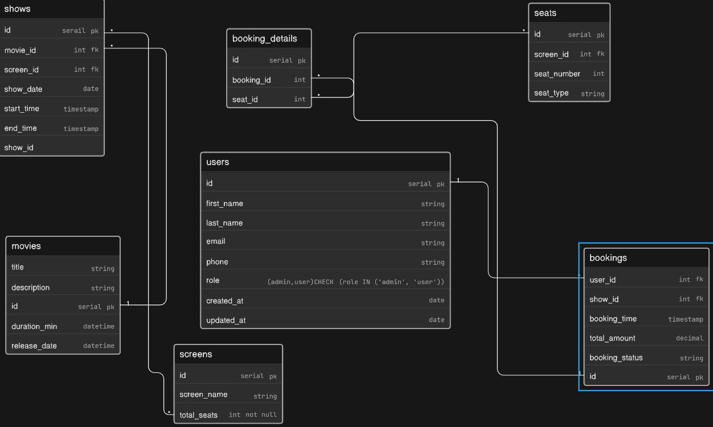

# Book My Show

A TypeScript/Node.js application for booking movie tickets online.

## Overview

**Book My Show** is a backend ticketing system that allows users to browse movies, select showtimes, and book tickets. The system ensures no double-booking and prevents multiple users from booking the same seat at the same time.

**Note:** This is a **backend system only** - no frontend UI is included.

## Features

- ✅ User registration and authentication
- ✅ Browse movies and available showtimes
- ✅ Book multiple tickets in a single transaction
- ✅ Real-time seat availability checking
- ✅ Prevent concurrent bookings of the same seat
- ℹ️ **Note:** Payment processing is not currently implemented

## Project Structure

This project includes the following core modules:

- **Users** - User management and authentication
- **Movies** - Movie catalog and details
- **Shows** - Movie showtimes and schedules
- **Screens** - Theater screens and seating information
- **Booking** - Ticket booking and reservation logic

## Schema

View the Entity-Relationship (ER) diagram:

## Tech Stack

- **Language:** TypeScript
- **Runtime:** Node.js
- **Package Manager:** npm

## Getting Started

1. Clone this repository
2. Install dependencies: `npm install`
3. Start the application: `npm start`

## License

MIT
